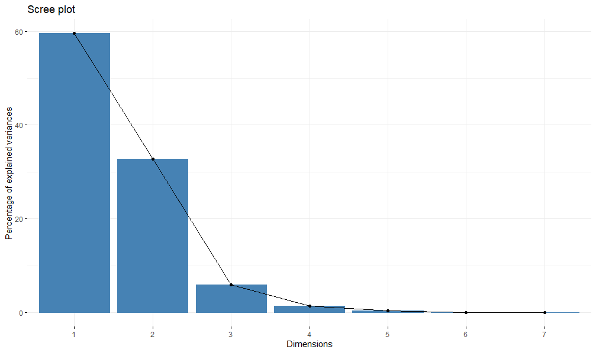
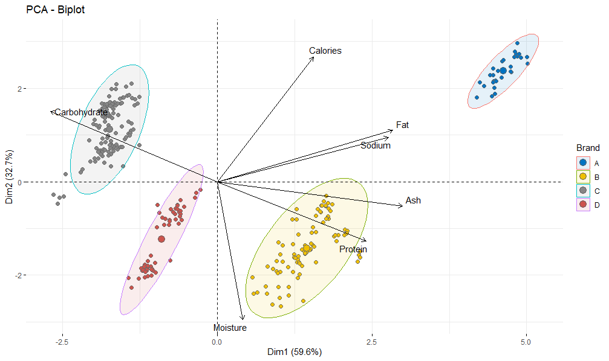
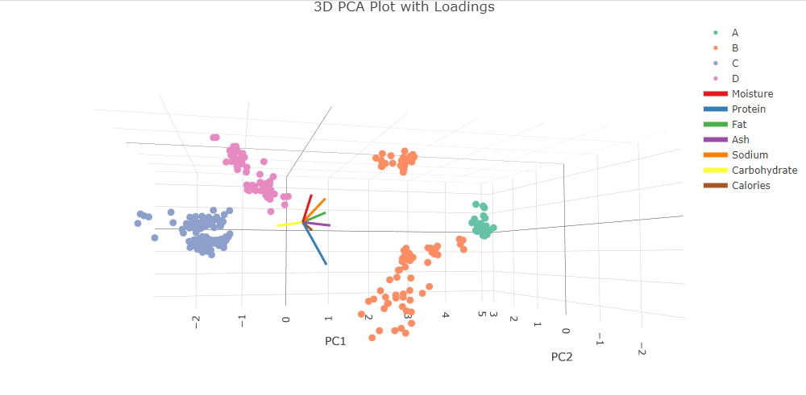

# Pizza Brand Analysis using Principal Component Analysis (PCA)

## Overview
This project applies **Principal Component Analysis (PCA)** to nutritional data
from four different pizza brands to identify patterns that distinguish brands
based on their composition.

The analysis explores whether a reduced number of latent factors can explain
most of the variation in pizza characteristics and whether these factors help
separate pizza brands in a lower-dimensional space.

---

## Dataset
The dataset contains nutritional information (per 100g) for pizzas from four
brands.

**Features included:**
- Moisture
- Protein
- Fat
- Ash
- Sodium
- Carbohydrate
- Calories

The objective is to determine which features drive the greatest variation and
how these relate to brand-level differences.

---

## Principal Components and Explained Variance

The scree plot shows:
- **PC1 explains ~60% of total variance**
- **PC2 explains ~30–35%**
- **PC3 explains ~5–10%**

Together, the first **three principal components explain nearly all of the
variance**, with a clear elbow at PC3. This indicates that dimensionality can be
safely reduced from seven variables to three principal components with minimal
information loss.

### Proportion of Variance Explained
| Principal Component | Proportion of Variance |
|--------------------|------------------------|
| PC1 | 0.596 |
| PC2 | 0.327 |
| PC3 | 0.059 |

---

## Feature Contributions to Principal Components

| Feature | PC1 | PC2 | PC3 |
|-------|-----|-----|-----|
| Moisture | 0.132 | -0.951 | 0.271 |
| Protein | 0.774 | -0.408 | -0.480 |
| Fat | 0.912 | 0.355 | 0.128 |
| Ash | 0.964 | -0.168 | -0.036 |
| Sodium | 0.890 | 0.305 | 0.293 |
| Carbohydrate | -0.868 | 0.485 | -0.034 |
| Calories | 0.499 | 0.859 | -0.073 |

### Interpretation
- **PC1** represents a **fat–protein–sodium axis**, with a strong negative
  relationship to carbohydrates
- **PC2** contrasts **moisture vs calorie density**, where lower moisture is
  associated with higher calories
- **PC3** captures smaller, more subtle effects, particularly related to
  moisture and protein

PC1 and PC2 explain the dominant nutritional trade-offs across pizza brands.

---

## Clustering of Pizza Brands

The PCA biplot shows clear brand-level structure:

- **Brands A and B** cluster around **Fat, Sodium, and Calories**
- **Brand C** aligns strongly with **Carbohydrates**
- **Brand D** is distinguished primarily by **Moisture**

Strong overlap between Fat, Sodium, and Calories indicates these variables tend
to increase together, while Carbohydrate and Moisture behave more independently.

---

## 3D PCA Visualisation

Since PC1 and PC2 already explain over 90% of the variance, the 3D plot adds
limited additional separation overall. However, **PC3 appears to improve the
classification of Brand D**, capturing subtle moisture-related variation not
fully represented in the first two components.

---

## Key Findings
- PCA successfully reduces dimensionality while retaining nearly all variance
- Nutritional differences between pizza brands are driven primarily by:
  - Fat–protein–sodium trade-offs
  - Moisture–calorie relationships
- Clear brand clustering emerges in PCA space
- PC3, while minor, provides useful refinement for specific brand separation

---

## Technologies Used
- R
- Principal Component Analysis (PCA)
- Data visualisation and multivariate analysis

---

## License
This project is licensed under the MIT License.
